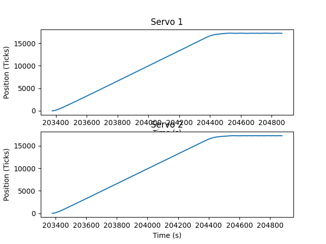
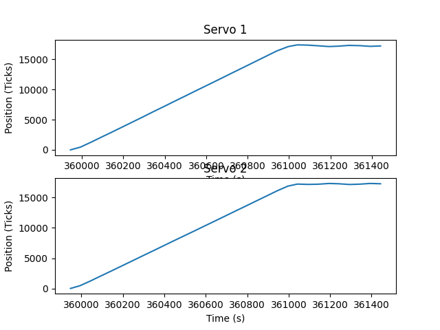
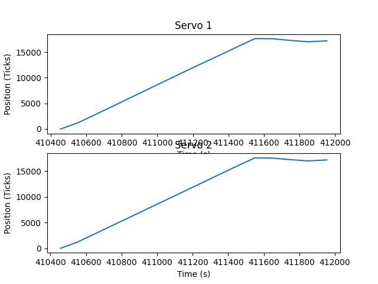
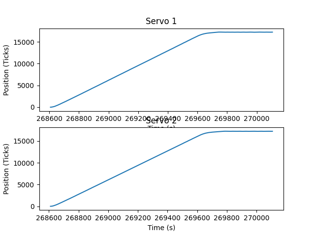

# Lab3

In this lab, we adapted the basic_tasks.py file from Professor Ridgely to run our step response
program from Lab 2. 

After successfully running the task with one motor, we incorporated a second motor to ensure that
we could manage two tasks and we had the correct hookups for our second motor.

After some trouble printing the data from the encoders, we tested the step response with different
periods:

The default period to run each task was 10ms. This offers a decent baseline to judge periods that 
greater than and smaller than this.

Increasing the period means that the task is not running as often, which can lead to bigger overshoots
as the difference between the current motor position and its target position is not being calculated as
often. This can be seen in the 50ms period run, and it is even more clear in the 100ms period run.

Decreasing the period offers greater accuracy and less jittering when approaching its target value.
However this comes at the cost of less time dedicated to other tasks. The more time that is dedicated
to this task, means the less time we have to check other critical systems. As we can see in the 6ms
period, the steady state is fairly flat.

